# MSXRetroThings
<i>Some nerdy hard- and software for MSX machines</i>

When I was a child, my first computer was a <a href="https://www.msx.org/wiki/Category:SVI-3x8">SV 318 MKII</a> with a cassette recorder. But not SPECTRON or ARMOURED ASSAULT were my favorites, the expansion port and the table of its pins in the manual took my fully interest.

Unfortunatelly, I had no real clou to connect the signals to my Z80 PIO in a way that it works so I lost the fun on playing around with the hardware.

Now, 40 years later, I got a <a href="https://www.msx.org/wiki/Spectravideo_SVI-728">SVI 728</a> and a  <a href="https://www.ebay.de/sch/i.html?item=332817640567&rt=nc&_trksid=p4429486.m145687.l2562&_ssn=fractal2000">memory mapper / sd card cartridge</a> from the bay and also a <a href="https://www.8bits4ever.net/product-page/sxe-msx2-fpga-computer">SX-E MSX2+</a> and started over.

I had a lot of chips in my basket like Z80 PIO, 8255, 8254, SJA1000, PCF8584 etc. The results are several MSX cartridges, ROM code and <a href="https://rc2014.co.uk/">RC2014 cards</a> which I would like to show you here as retro and nerdy stuff for own developments or just for gambling.

Some of the software stuff comes from KONAMIMAN, especially the UNAPI structure and also the memory allocation in basic for working areas in RAM. Please have a look at his <a href="https://www.konamiman.com/msx/msx-e.html">git</a> for further information.

Have fun and stay healthy,

Thomas

## 1. MSXRetroThings - The XIO cartridge

#### <b>1.1 The XIO cartridge contains these functions:</b>

+ Switched IO based on the idea of ASCII to achive 256 additional IO locations
+ 8 channel programable interrupt controller 8259 with fallen edge sensitive inputs
+ 8 channel daisy chain IM2 emulator
+ BASIC and UNAPI commands to controll the functionallities of the cartridge in on board BIOS ROM

#### <b>1.2 Impressions:</b>

XIO cartridge used in a SX-E MSX2+ with adapter to RC2014 backplane

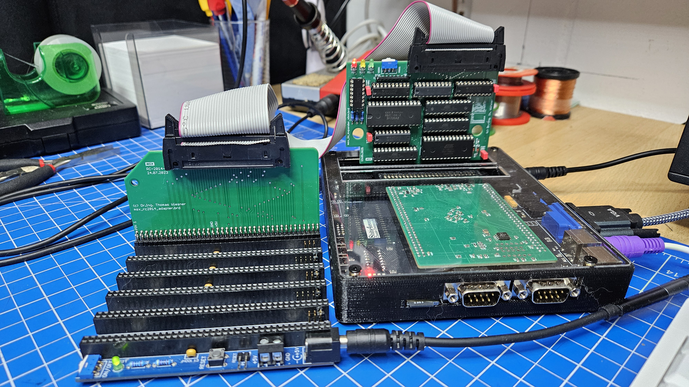

XIO cartridge

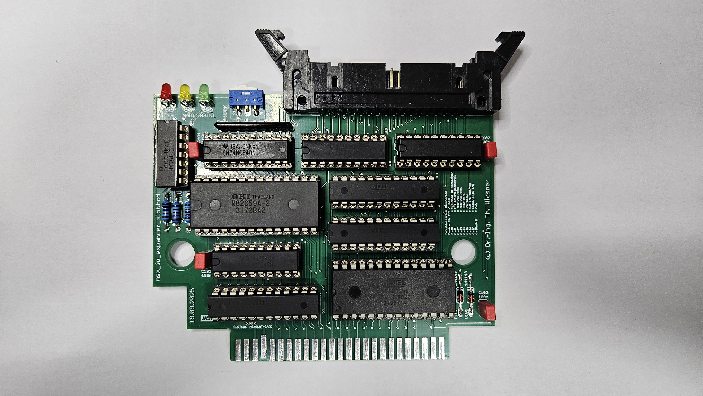

Boot message from BIOS ROM

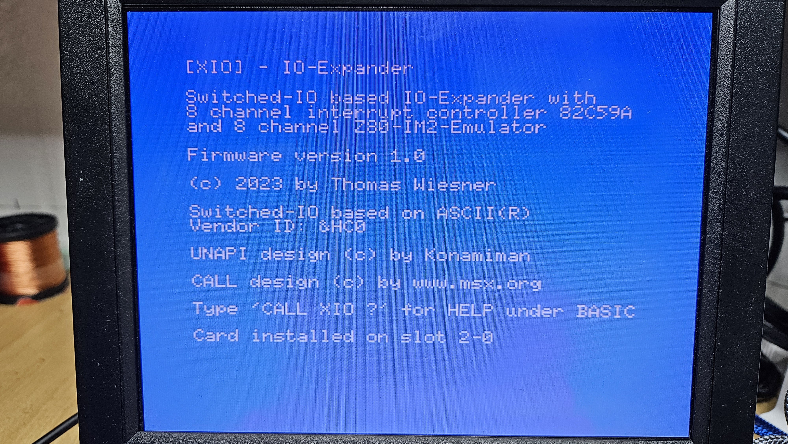

#### <b>1.3 Hardware:</b>

The schematics of XIO is strictly build up in non smd method to enable people without special tools to rebuild the pcb. But it uses GAL chips for the switched IO decoder, the glue decoder for controll signals and the address decoder.

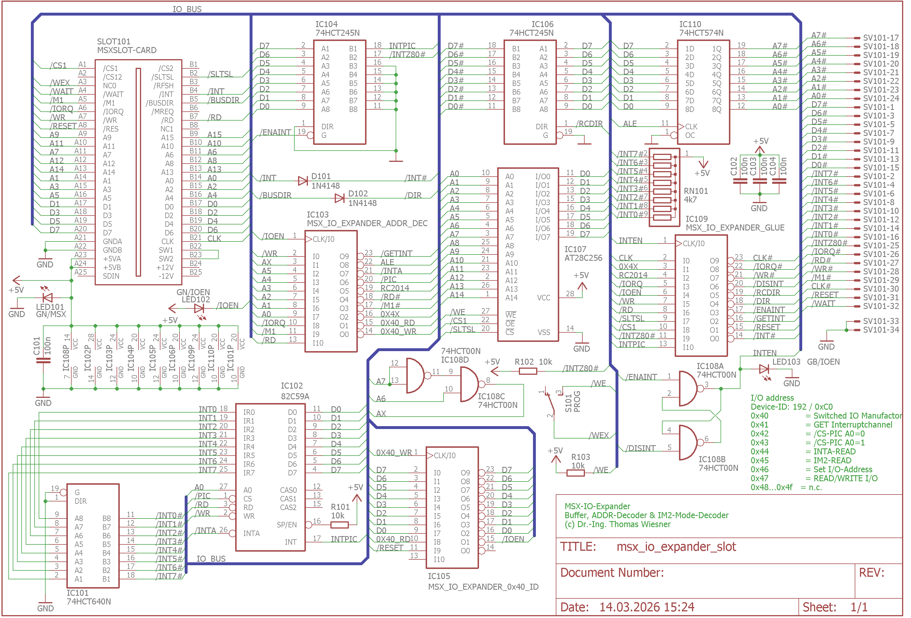

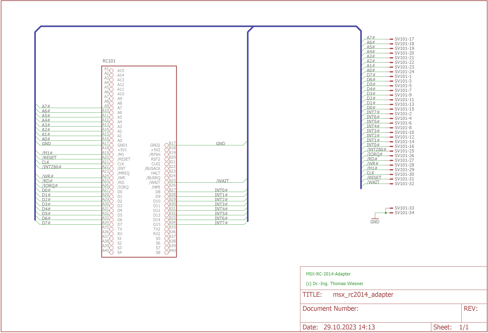

The XIO OUT/IN functions work without installing the XIO card. If the XIO card is installed correctly, the green LED shows that alle 16 interrupt channels are ready to use. A blinking yellow LED shows activities to the switched IO addresses. It signals, that the switched IO is selected via &H40 of the original MSX IO bus. The red LED shows a working supply.

#### <b>1.4 Software:</b>

The BIOS for the card functions is provided in the on board ROM (EEPROM). It contains the additional BASIC commands and an instance of UNAPI base on the approach of KONAMIMAN. Please have a look at his page to get a deeper impression on how it works.

Commands implemented in ROM:

+ <i><b>XIO ?</i></b>

  Prints the list of available XIO commands directly to the screen. Works independently from XIO INIT, so it is always safe to call even if the card was never installed - useful as a quick "is this ROM extension actually loaded" check.

|  | Definition | BASIC* | UNAPI |
| --- | --- | --- | --- |
| Syntax | XIO ? | _XIO ? | 1 |

*) ROM only

+ <i><b>XIO OUT</i></b>

  Sends a single raw byte to one of the 256 additional switched IO addresses the XIO address decoder provides. Works independently from XIO INIT and the whole interrupt/PIC subsystem - a plain digital output, nothing more.

|  | Definition | BASIC* | UNAPI |
| --- | --- | --- | --- |
| Syntax | XIO OUT | _XIO OUT(ADDR,DATA) | 2 |
| PARA 1 | IO addr 0...255 | byte or variable | C |
| PARA 2 | IO data 0...255 | byte or variable | B |

*) ROM only

+ <i><b>XIO INP</i></b>

  Reads a single raw byte back from one of the 256 switched IO addresses. Like XIO OUT, this bypasses XIO INIT and the interrupt system entirely - a plain digital input.

|  | Definition | BASIC* | UNAPI |
| --- | --- | --- | --- |
| Syntax | XIO INP | _XIO INP(ADDR,DATA) | 3 |
| PARA 1 | IO addr 0...255 | byte or variable | C |
| PARA 2 | IO data 0...255 | variable | DE as varptr |

*) ROM only

+ <i><b>XIO INIT</i></b>

  Installs the XIO card: allocates the BIOS work area and hooks the standard IM2/PIC interrupt dispatcher. The status variable is not read once at install time - the ROM keeps writing into it on every interrupt for the rest of the program's run, one bit per channel (0..15), so a caller can just poll the variable instead of writing its own interrupt handler.

|  | Definition | BASIC* | UNAPI |
| --- | --- | --- | --- |
| Syntax | XIO INIT | _XIO INIT(CHANNEL) | 4 |
| PARA 1 | status | variable | DE as varptr |
| PARA 2 | Working area in RAM | automatic by BIOS | HL |

*) ROM only

+ <i><b>XIO ISINIT</i></b>

  Checks whether XIO is already installed, without touching anything. The usual pattern is ISINIT, then DEINIT if it reports 1, then INIT - so a program never ends up stacking a second installation on top of an old one from a previous run.

|  | Definition | BASIC* | UNAPI |
| --- | --- | --- | --- |
| Syntax | XIO ISINIT | _XIO ISINIT(ISI) | 5 |
| PARA 1 | 0 = not installed, 1 = installed | variable | DE as varptr |

*) ROM only

+ <i><b>XIO DEINIT</i></b>

  Uninstalls the XIO card: unhooks the interrupt dispatcher and releases the BIOS work area again, so a program can clean up before it exits.

|  | Definition | BASIC* | UNAPI |
| --- | --- | --- | --- |
| Syntax | XIO DEINIT | _XIO DEINIT | 6 |

*) ROM only

+ <i><b>XIO SET ADDR</i></b>

  Registers a custom Z80 machine code service routine for one of the 16 IM2/PIC channels. Once set, the standard dispatcher calls this routine directly whenever that channel's interrupt fires, instead of only updating the passive status bit that XIO INIT's variable exposes - use this when a channel needs to react immediately rather than being polled.

|  | Definition | BASIC* | UNAPI |
| --- | --- | --- | --- |
| Syntax | XIO SET ADDR | _XIO SET ADDR(CHANNEL,ADDR) | 7 |
| PARA 1 | channel | byte or variable | B |
| PARA 2 | addr | word or variable | DE |
| PARA 3 | slot | automatic by BIOS | C |

*) ROM only

+ <i><b>XIO SET MASK</i></b>

  Enables or disables interrupt channels via a 16-bit bitmask (bit N = channel N). All channels start out disabled after XIO INIT, so this must be called at least once before any channel actually generates interrupts - by convention it is called last, only once the rest of a program's setup (card init, custom SET ADDR routines, etc.) has already completed.

|  | Definition | BASIC* | UNAPI |
| --- | --- | --- | --- |
| Syntax | XIO SET MASK | _XIO SET MASK(MASK) | 8 |
| PARA 1 | Bit Chx: 0 = disabled, 1 = enabled | word or variable | DE |

*) ROM only

+ <i><b>XIO GET ADDR</i></b>

  Reads back which service routine address is currently registered for a given channel - the counterpart to XIO SET ADDR, mainly useful for diagnostics.

|  | Definition | BASIC* | UNAPI |
| --- | --- | --- | --- |
| Syntax | XIO GET ADDR | _XIO GET ADDR(CHANNEL,ADDR) | 9 |
| PARA 1 | channel | byte or variable | B |
| PARA 2 | addr | variable | DE as varptr |
| PARA 3 | slot | automatic by BIOS | C |

*) ROM only

+ <i><b>XIO GET MASK</i></b>

  Reads back the current 16-bit enable/disable bitmask - the counterpart to XIO SET MASK.

|  | Definition | BASIC* | UNAPI |
| --- | --- | --- | --- |
| Syntax | XIO GET MASK | _XIO GET MASK(MASK) | 10 |
| PARA 1 | Bit Chx: 0 = disabled, 1 = enabled | variable | DE as varptr |

*) ROM only

## 2. MSXRetroThings - The RCX ROM cartridge and RC2014 cards

#### <b>2.1 The RCX ROM cartridge contains these functions:</b>

+ Up to 16 RC2014 cards installable with used IO address control and 16 bytes of free RAM each card

+ RC2014 card with PCF8584 I2C Controller (3 ports via Seeed) and PCF8583 battery buffered RTC

+ RC2014 card with SJA1000 CAN controller (single use only)

+ RC2014 card with 8255A PIO

+ RC2014 card with 8254A CTR

+ RC2014 card with 4x SPI bus up to 2 MHz via ATMEGA8

+ RC2014 card with ADS1220 4 channel 24 bit A/D converter via ATMEGA8

+ RC2014 card with MCP4822 4 channel 12 bit D/A converter via ATMEGA8

+ RC2014 card SC103 with Z80 PIO

+ RC2014 card SC725 with Z80 SIO and Z80 CTC

+ BASIC and UNAPI commands to controll the functions of the cartridge in separate BIOS ROM cartridge

The schematics of RC2014 cards are strictly build up in non smd method to enable people without special tools to rebuild the pcb.

#### <b>2.2 Impressions:</b>

Slot ROM

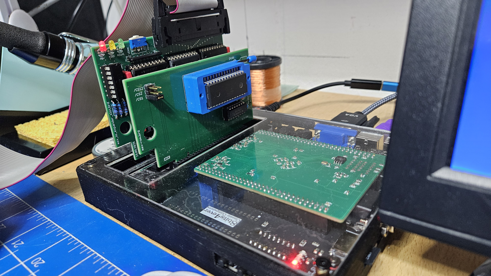

Boot message from BIOS ROM

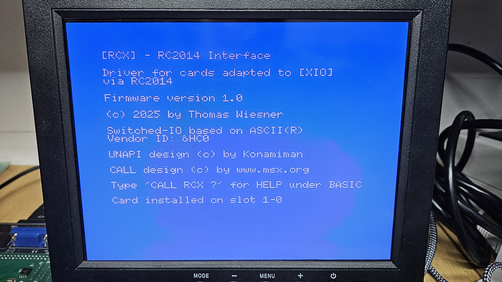

#### <b>2.3 Hardware:</b>

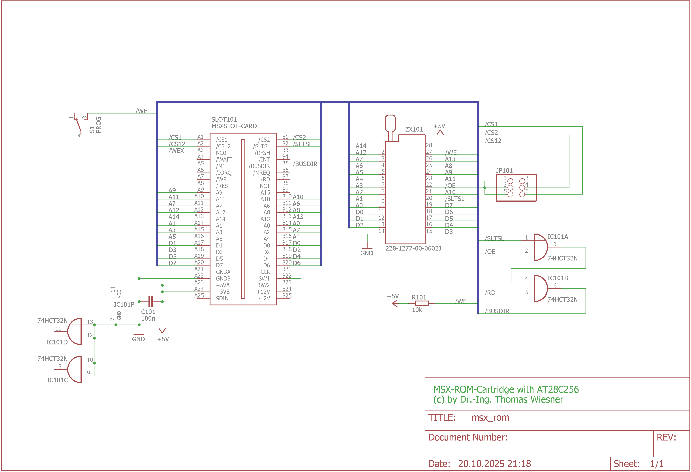

#### <b>2.4 Software:</b>

The BIOS for the card functions is provided in the on board ROM (EEPROM). It contains the additional BASIC commands and an instance of UNAPI base on the approach of KONAMIMAN. Please have a look at his page to get a deeper impression on how it works.

As a software-only alternative to the physical ROM cartridge, [`RCXRAM.COM`](rcx/rc2014_rom+ram/drv/RCXRAM.COM) installs the same `RCX_INTERFACE` UNAPI driver into mapped RAM at runtime instead of requiring a burned EEPROM - useful for testing and development without the actual cartridge. It is UNAPI/EXTBIOS-only (no BASIC `CALL` support, since that relies on BASIC's own boot-time scan of ROM header slots, which does not apply to a RAM segment). Covers all card types A through G.

Commands implemented in ROM for steering and controlling of the cards functions:

+ <i><b>RCX ?</i></b>

  Prints the list of available RCX commands directly to the screen. Works independently from RCX INIT, so it is always safe to call even if no card has been registered yet.

|  | Definition | BASIC* | UNAPI |
| --- | --- | --- | --- |
| Syntax | RCX ? | _RCX ? | 1 |

*) ROM only

+ <i><b>RCX INIT</i></b>

  Installs the RCX driver itself: allocates and clears the internal table that tracks which RC2014 card types are registered at which IO address. Every other RCX/card-specific command needs this table to exist, so it must run before any card-type INIT (I2C INIT, PIO INIT, etc.); calling it again while already installed just resets the table.

|  | Definition | BASIC* | UNAPI |
| --- | --- | --- | --- |
| Syntax | RCX INIT | _RCX INIT | 2 |
| PARA 1 | Working area in RAM | automatic by BIOS | HL |

*) ROM only

+ <i><b>RCX ISINIT</i></b>

  Checks whether the RCX driver is already installed, without touching anything - same ISINIT/DEINIT/INIT pattern as XIO ISINIT.

|  | Definition | BASIC* | UNAPI |
| --- | --- | --- | --- |
| Syntax | RCX ISINIT | _RCX ISINIT(ISI) | 3 |
| PARA 1 | 0 = not installed, 1 = installed | variable | DE as varptr |

*) ROM only

+ <i><b>RCX DEINIT</i></b>

  Uninstalls the RCX driver and frees the card table again.

|  | Definition | BASIC* | UNAPI |
| --- | --- | --- | --- |
| Syntax | RCX DEINIT | _RCX DEINIT | 4 |

*) ROM only

+ <i><b>RCX TABLE</i></b>

  Returns the RAM address of the internal per-slot card table directly, mainly useful for diagnostics - inspecting which addresses and card types are currently registered without a dedicated command for each one.

|  | Definition | BASIC* | UNAPI |
| --- | --- | --- | --- |
| Syntax | RCX TABLE | _RCX TABLE(ADDR) | 5 |
| PARA 1 | ADDR of RCX table | variable | DE as varptr |

*) ROM only

## A) RC2014 card with PCF8584 I2C Controller (3 ports via Seeed) and PCF8583 battery buffered RTC:

This RC2014 card contains an I2C bus controller PCF8584 and a PCF8583 RTC buffered by battery. The interrupt pins of both chips can be assigned to one of the XIO PIC interrupt channels.
Up to 16 cards of this type are possible.

#### <b>A.1 Impressions:</b>

RC2014 card on backplane

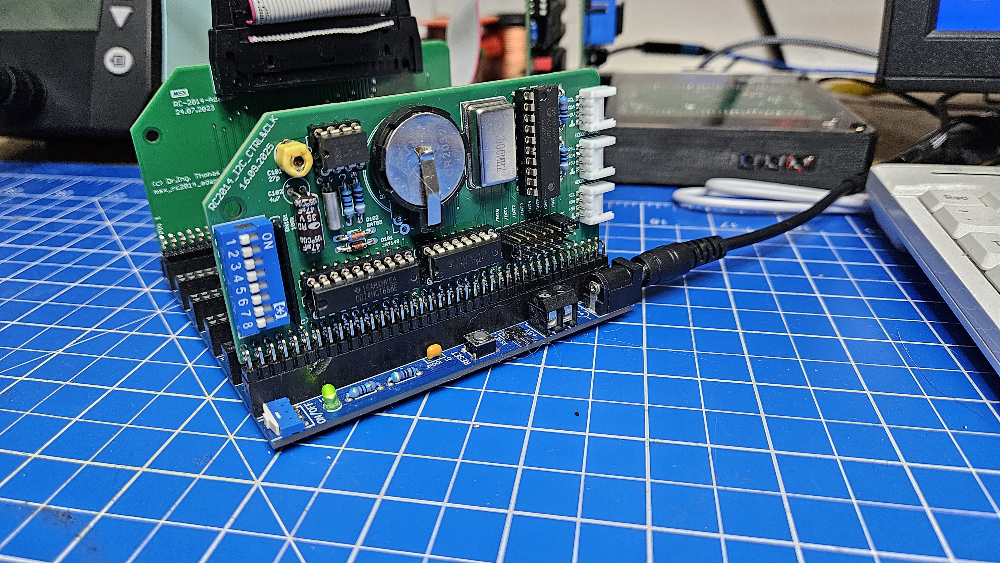

RC2014 card on backplane with I2C LCD from Seeed

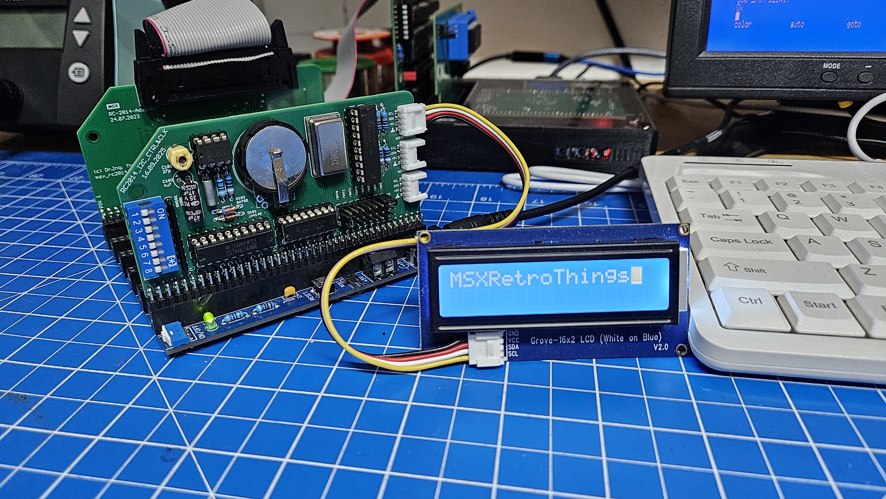

RC2014 card on backplane contacted via BASIC to get TIME and DATE

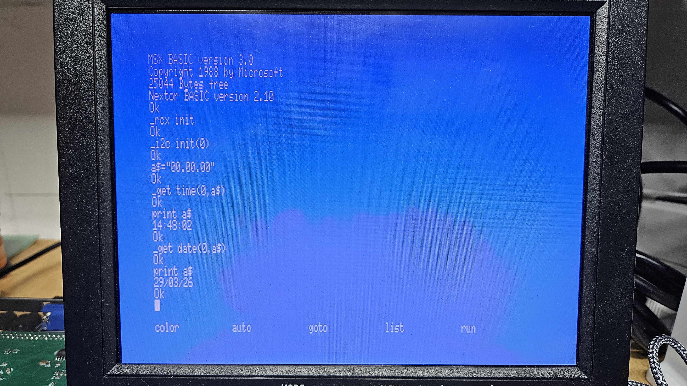

#### <b>A.2 Hardware:</b>

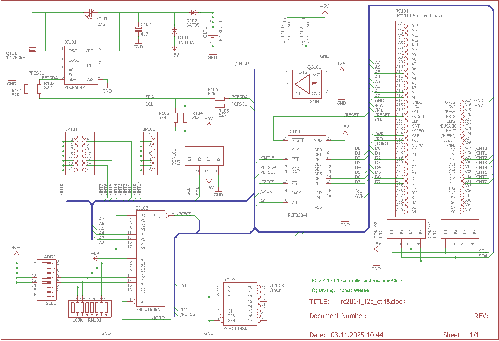

#### <b>A.3 Software:</b>

The BIOS for the card functions is provided in the RCX slot ROM. It contains the additional BASIC commands (`I2C INIT/WR/WRB/RD/RDB/RESET`, `SET/GET TIME/DATE`) and an instance of UNAPI based on the approach of KONAMIMAN, so the same functions are callable directly via UNAPI/EXTBIOS from a `.COM` program without the BASIC interpreter. Test software exists both as interactive BASIC programs and as `.COM` tools, including a variant that keeps the SEED I2C LCD updated on every PIC interrupt and one that stays resident in memory (MemMan TSR) to keep updating the display in the background. Please have a look at his page to get a deeper impression on how it works.

Commands implemented in ROM:

+ <i><b>I2C INIT</i></b>

  Registers the card's IO base address in the RCX table. Must be called once per card before any of the other I2C/RTC commands below will find it.

|  | Definition | BASIC* | UNAPI |
| --- | --- | --- | --- |
| Syntax | I2C INIT | _I2C INIT(ADDR) | 6 |
| PARA 1 | IO addr 0...254 | byte or variable | C |

*) ROM only

+ <i><b>I2C WR</i></b>

  Writes a single byte to a specific I2C slave device's address on the bus - the basic building block for talking to anything hanging off the PCF8584 (an LCD, a sensor, another RTC, ...).

|  | Definition | BASIC* | UNAPI |
| --- | --- | --- | --- |
| Syntax | I2C WR | _I2C WR(BUS,CHIP,DATA) | 7 |
| PARA 1 | IO bus addr 0...254 | byte or variable | E |
| PARA 2 | I2C addr 0...254 | byte or variable | C |
| PARA 3 | Data | byte or variable | B |

*) ROM only

+ <i><b>I2C WRB</i></b>

  Writes an arbitrary-length block of bytes to a specific I2C slave in one call, instead of looping single I2C WR calls - used e.g. to send a whole HD44780 LCD command/data sequence at once.

|  | Definition | BASIC* | UNAPI |
| --- | --- | --- | --- |
| Syntax | I2C WRB | _I2C WRB(BUS,CHIP,LEN,DATA) | 8 |
| PARA 1 | IO bus addr 0...254 | byte or variable | H |
| PARA 2 | I2C addr 0...254 | byte or variable | C |
| PARA 3 | Length | byte or variable | B |
| PARA 4 | Data | array index 0 | DE as varptr |

*) ROM only

+ <i><b>I2C RD</i></b>

  Reads a single byte back from a specific I2C slave device's address.

|  | Definition | BASIC* | UNAPI |
| --- | --- | --- | --- |
| Syntax | I2C RD | _I2C RD(BUS,CHIP,DATA) | 9 |
| PARA 1 | IO bus addr 0...254 | byte or variable | C |
| PARA 2 | I2C addr 0...254 | byte or variable | B |
| PARA 3 | Data | variable | DE as varptr |

*) ROM only

+ <i><b>I2C RDB</i></b>

  Reads an arbitrary-length block of bytes back from a specific I2C slave in one call.

|  | Definition | BASIC* | UNAPI |
| --- | --- | --- | --- |
| Syntax | I2C RDB | _I2C RDB(BUS,CHIP,LEN,DATA) | 10 |
| PARA 1 | IO bus addr 0...254 | byte or variable | H |
| PARA 2 | I2C addr 0...254 | byte or variable | C |
| PARA 3 | Length | byte or variable | B |
| PARA 4 | Data | array index 0 | DE as varptr |

*) ROM only

+ <i><b>I2C RESET</i></b>

  Resets the PCF8584 I2C bus controller itself (not a specific slave device) - useful to recover a bus that got stuck, e.g. after a slave was interrupted mid-transfer.

|  | Definition | BASIC* | UNAPI |
| --- | --- | --- | --- |
| Syntax | I2C RESET | _I2C RESET(ADDR) | 11 |
| PARA 1 | IO addr 0...254 | byte or variable | C |

*) ROM only

+ <i><b>SET TIME</i></b>

  Writes the time-of-day into the on-board PCF8583 RTC, as an 8-character `HH:MM:SS` string.

|  | Definition | BASIC* | UNAPI |
| --- | --- | --- | --- |
| Syntax | SET TIME | _SET TIME RD(BUS,TIME) | 12 |
| PARA 1 | IO bus addr 0...254 | byte or variable | C |
| PARA 2 | TIME | String variable len = 8 | DE as varptr |

*) ROM only

+ <i><b>GET TIME</i></b>

  Reads the current time-of-day back from the PCF8583 RTC, as an 8-character `HH:MM:SS` string.

|  | Definition | BASIC* | UNAPI |
| --- | --- | --- | --- |
| Syntax | GET TIME | _GET TIME RD(BUS,TIME) | 13 |
| PARA 1 | IO bus addr 0...254 | byte or variable | C |
| PARA 2 | TIME | String variable len = 8 | DE as varptr |

*) ROM only

+ <i><b>SET DATE</i></b>

  Writes the date into the on-board PCF8583 RTC, as an 8-character `DD/MM/YY` string.

|  | Definition | BASIC* | UNAPI |
| --- | --- | --- | --- |
| Syntax | SET DATE | _SET DATE RD(BUS,DATE) | 14 |
| PARA 1 | IO bus addr 0...254 | byte or variable | C |
| PARA 2 | DATE | String variable len = 8 | DE as varptr |

*) ROM only

+ <i><b>GET DATE</i></b>

  Reads the current date back from the PCF8583 RTC, as an 8-character `DD/MM/YY` string.

|  | Definition | BASIC* | UNAPI |
| --- | --- | --- | --- |
| Syntax | GET DATE | _GET DATE RD(BUS,DATE) | 15 |
| PARA 1 | IO bus addr 0...254 | byte or variable | C |
| PARA 2 | DATE | String variable len = 8 | DE as varptr |

*) ROM only

## B) RC2014 card SC103 with Z80 PIO

The ROM of RCX contains BASIC and UNAPI commands to steer SC103 from original RC2014 manufactor.

#### <b>B.1 Impressions:</b>

RC2014 card on backplane

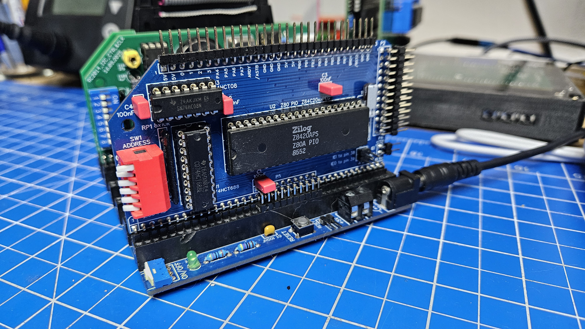

#### <b>B.2 Hardware:</b>

Please visit RC2014 homepage for further information

#### <b>B.3 Software:</b>

The BIOS for the card functions is provided in the RCX slot ROM. It contains the additional BASIC commands (`PIO INIT`, `PIO A/B RD/WR`, `PIO A/B CTRL`) and an instance of UNAPI based on the approach of KONAMIMAN, so the same functions are callable directly via UNAPI/EXTBIOS from a `.COM` program without the BASIC interpreter. A second test program drives Port B in the Z80 PIO's own IM2 interrupt mode, with a small Z80 machine code service routine registered through `XIO SET ADDR` that reports which channel fired. Please have a look at his page to get a deeper impression on how it works.

Commands implemented in ROM:

+ <i><b>PIO INIT</i></b>

  Registers the card's IO base address in the RCX table. Must be called once per card before any of the other PIO commands below will find it.

|  | Definition | BASIC* | UNAPI |
| --- | --- | --- | --- |
| Syntax | PIO INIT | _PIO INIT(ADDR) | 16 |
| PARA 1 | IO addr 0...252 | byte or variable | C |

*) ROM only

+ <i><b>PIO A RD</i></b>

  Reads the current byte at Z80 PIO Port A's data register, in whatever mode Port A is currently configured for via PIO A CTRL.

|  | Definition | BASIC* | UNAPI |
| --- | --- | --- | --- |
| Syntax | PIO A RD | _PIO A RD(ADDR,VALUE) | 17 |
| PARA 1 | IO addr 0...252 | byte or variable | C |
| PARA 2 | Byte to read | variable | DE as varptr |
| PARA 3 | UNAPI ID Level 2 | -/- | B = 0 |

*) ROM only

+ <i><b>PIO A WR</i></b>

  Writes a byte to Z80 PIO Port A's data register.

|  | Definition | BASIC* | UNAPI |
| --- | --- | --- | --- |
| Syntax | PIO A WR | _PIO A WR(ADDR,VALUE) | 18 |
| PARA 1 | IO addr 0...252 | byte or variable | C |
| PARA 2 | Byte to write | byte or variable | D |
| PARA 3 | UNAPI ID Level 2 | -/- | B = 1 |

*) ROM only

+ <i><b>PIO B RD</i></b>

  Reads the current byte at Z80 PIO Port B's data register.

|  | Definition | BASIC* | UNAPI |
| --- | --- | --- | --- |
| Syntax | PIO B RD | _PIO B RD(ADDR,VALUE) | 19 |
| PARA 1 | IO addr 0...252 | byte or variable | C |
| PARA 2 | Byte to read | variable | DE as varptr |
| PARA 3 | UNAPI ID Level 2 | -/- | B = 2 |

*) ROM only

+ <i><b>PIO B WR</i></b>

  Writes a byte to Z80 PIO Port B's data register.

|  | Definition | BASIC* | UNAPI |
| --- | --- | --- | --- |
| Syntax | PIO B WR | _PIO B WR(ADDR,VALUE) | 20 |
| PARA 1 | IO addr 0...252 | byte or variable | C |
| PARA 2 | Byte to write | byte or variable | D |
| PARA 3 | UNAPI ID Level 2 | -/- | B = 3 |

*) ROM only

+ <i><b>PIO A CTRL</i></b>

  Writes a raw control byte to Port A's mode/control register - selects the port's operating mode (0..3), direction, interrupt vector and interrupt mask bits, matching the Z80 PIO datasheet's control word format directly.

|  | Definition | BASIC* | UNAPI |
| --- | --- | --- | --- |
| Syntax | PIO A CTRL | _PIO A CTRL(ADDR,VALUE) | 21 |
| PARA 1 | IO addr 0...252 | byte or variable | C |
| PARA 2 | Byte to write | byte or variable | D |
| PARA 3 | UNAPI ID Level 2 | -/- | B = 4 |

*) ROM only

+ <i><b>PIO B CTRL</i></b>

  Writes a raw control byte to Port B's mode/control register, same format as PIO A CTRL.

|  | Definition | BASIC* | UNAPI |
| --- | --- | --- | --- |
| Syntax | PIO B CTRL | _PIO B CTRL(ADDR,VALUE) | 22 |
| PARA 1 | IO addr 0...252 | byte or variable | C |
| PARA 2 | Byte to write | byte or variable | D |
| PARA 3 | UNAPI ID Level 2 | -/- | B = 5 |

*) ROM only

## C) RC2014 card with 8255A PIO

RC2014 card with a 8255 PIO. Up to 16 cards are possible. The interrupt pins of PORT C can be assigned to one of the XIO PIC interrupt channels.

#### <b>C.1 Impressions:</b>

RC2014 card on backplane

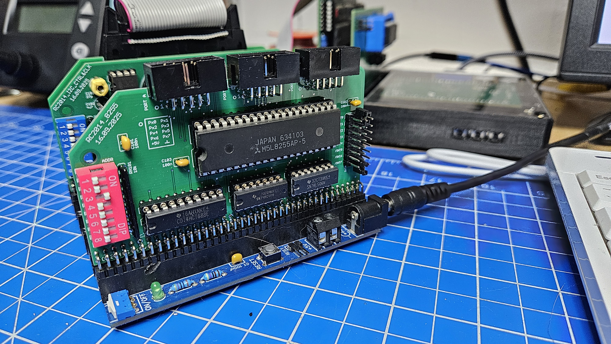

#### <b>C.2 Hardware:</b>

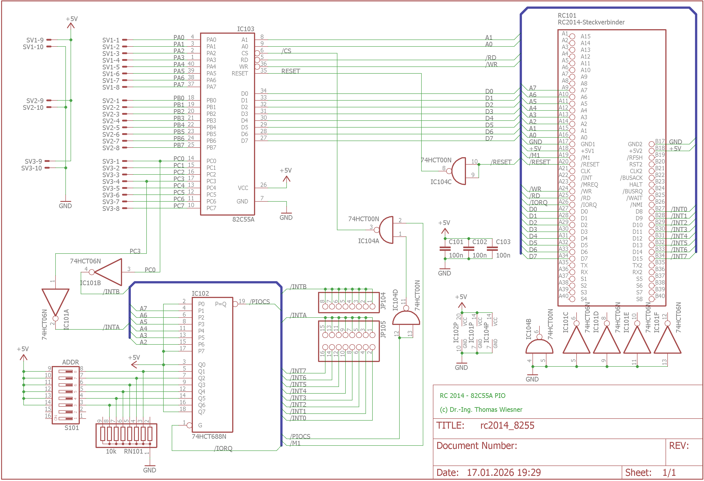

#### <b>C.3 Software:</b>

The BIOS for the card functions is provided in the RCX slot ROM. It contains the additional BASIC commands (`PPI INIT`, `PPI A/B/C RD/WR`, `PPI CTRL`, `PPI SET/RESET`) and an instance of UNAPI based on the approach of KONAMIMAN, so the same functions are callable directly via UNAPI/EXTBIOS from a `.COM` program without the BASIC interpreter. A second test program runs Port B in Mode 1 (strobed input), where the 82C55 itself raises `INTR B` on PC0 - reported through XIO's standard interrupt handler, no custom service routine needed. Please have a look at his page to get a deeper impression on how it works.

Commands implemented in ROM:

+ <i><b>PPI INIT</i></b>

  Registers the card's IO base address in the RCX table. Must be called once per card before any of the other PPI commands below will find it.

|  | Definition | BASIC* | UNAPI |
| --- | --- | --- | --- |
| Syntax | PPI INIT | _PPI INIT(ADDR) | 23 |

*) ROM only

+ <i><b>PPI A RD</i></b>

  Reads the current byte at 82C55 Port A, in whatever mode it is currently configured for via PPI CTRL.

|  | Definition | BASIC* | UNAPI |
| --- | --- | --- | --- |
| Syntax | PPI A RD | _PPI A RD(ADDR,VALUE) | 24 |
| PARA 1 | IO addr 0...252 | byte or variable | C |
| PARA 2 | Byte to read | variable | DE as varptr |
| PARA 3 | UNAPI ID Level 2 | -/- | B = 0 |

*) ROM only

+ <i><b>PPI A WR</i></b>

  Writes a byte to 82C55 Port A.

|  | Definition | BASIC* | UNAPI |
| --- | --- | --- | --- |
| Syntax | PPI A WR | _PPI A WR(ADDR,VALUE) | 25 |
| PARA 1 | IO addr 0...252 | byte or variable | C |
| PARA 2 | Byte to write | byte or variable | D |
| PARA 3 | UNAPI ID Level 2 | -/- | B = 1 |

*) ROM only

+ <i><b>PPI B RD</i></b>

  Reads the current byte at 82C55 Port B.

|  | Definition | BASIC* | UNAPI |
| --- | --- | --- | --- |
| Syntax | PPI B RD | _PPI B RD(ADDR,VALUE) | 26 |
| PARA 1 | IO addr 0...252 | byte or variable | C |
| PARA 2 | Byte to read | variable | DE as varptr |
| PARA 3 | UNAPI ID Level 2 | -/- | B = 2 |

*) ROM only

+ <i><b>PPI B WR</i></b>

  Writes a byte to 82C55 Port B.

|  | Definition | BASIC* | UNAPI |
| --- | --- | --- | --- |
| Syntax | PPI B WR | _PPI B WR(ADDR,VALUE) | 27 |
| PARA 1 | IO addr 0...252 | byte or variable | C |
| PARA 2 | Byte to write | byte or variable | D |
| PARA 3 | UNAPI ID Level 2 | -/- | B = 3 |

*) ROM only

+ <i><b>PPI C RD</i></b>

  Reads the current byte at 82C55 Port C.

|  | Definition | BASIC* | UNAPI |
| --- | --- | --- | --- |
| Syntax | PPI C RD | _PPI C RD(ADDR,VALUE) | 28 |
| PARA 1 | IO addr 0...252 | byte or variable | C |
| PARA 2 | Byte to read | variable | DE as varptr |
| PARA 3 | UNAPI ID Level 2 | -/- | B = 4 |

*) ROM only

+ <i><b>PPI C WR</i></b>

  Writes a byte to 82C55 Port C.

|  | Definition | BASIC* | UNAPI |
| --- | --- | --- | --- |
| Syntax | PPI C WR | _PPI C WR(ADDR,VALUE) | 29 |
| PARA 1 | IO addr 0...252 | byte or variable | C |
| PARA 2 | Byte to write | byte or variable | D |
| PARA 3 | UNAPI ID Level 2 | -/- | B = 5 |

*) ROM only

+ <i><b>PIO CTRL</i></b>

  Writes the 82C55's mode-control word - selects Mode 0/1/2 independently for the two port groups and sets each port's direction, matching the 82C55 datasheet's control word format directly.

|  | Definition | BASIC* | UNAPI |
| --- | --- | --- | --- |
| Syntax | PPI CTRL | _PPI CTRL(ADDR,VALUE) | 30 |
| PARA 1 | IO addr 0...252 | byte or variable | C |
| PARA 2 | Byte to write | byte or variable | D |
| PARA 3 | UNAPI ID Level 2 | -/- | B = 6 |

*) ROM only

+ <i><b>PPI SET</i></b>

  Sets a single bit (0..7) of Port C using the 82C55's built-in bit-set/reset (BSR) mode - a single-instruction toggle without a separate read-modify-write, typically used for the interrupt-enable/handshake bits Port C carries in Mode 1/2.

|  | Definition | BASIC* | UNAPI |
| --- | --- | --- | --- |
| Syntax | PPI SET | _PPI SET(ADDR,VALUE) | 31 |
| PARA 1 | IO addr 0...252 | byte or variable | C |
| PARA 2 | Bit to set | byte or variable | D |
| PARA 3 | UNAPI ID Level 2 | -/- | B = 7 |

*) ROM only

+ <i><b>PPI RESET</i></b>

  Clears a single bit (0..7) of Port C via the same BSR mechanism as PPI SET.

|  | Definition | BASIC* | UNAPI |
| --- | --- | --- | --- |
| Syntax | PPI RESET | _PPI RESET(ADDR,VALUE) | 32 |
| PARA 1 | IO addr 0...252 | byte or variable | C |
| PARA 2 | Bit to reset | byte or variable | D |
| PARA 3 | UNAPI ID Level 2 | -/- | B = 8 |

*) ROM only

## D) RC2014 card with 8254A CTR

RC2014 card with a 8254 CTR. Up to 16 cards are possible. The interrupt pins of TIMER 0 and 1 can be assigned to one of the XIO PIC interrupt channels. This module does not work with internal clock if 8253 (max. 1 MHz) is used.

#### <b>D.1 Impressions:</b>

RC2014 card on backplane

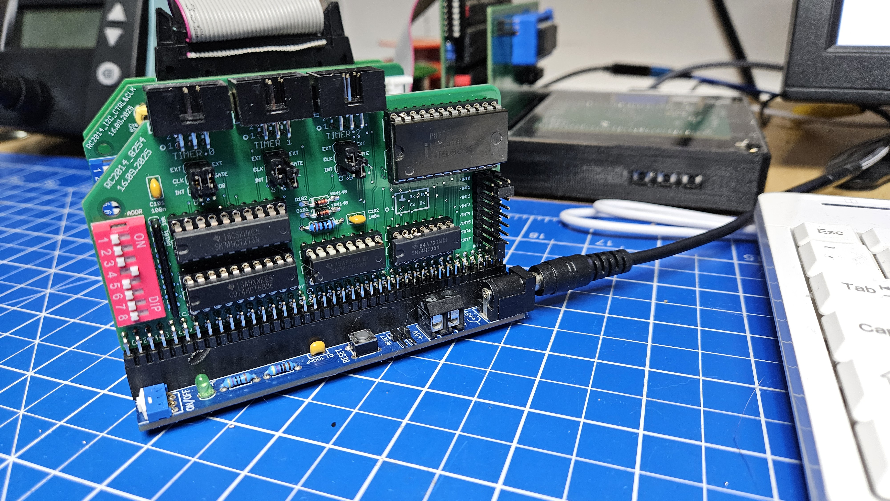

#### <b>D.2 Hardware:</b>

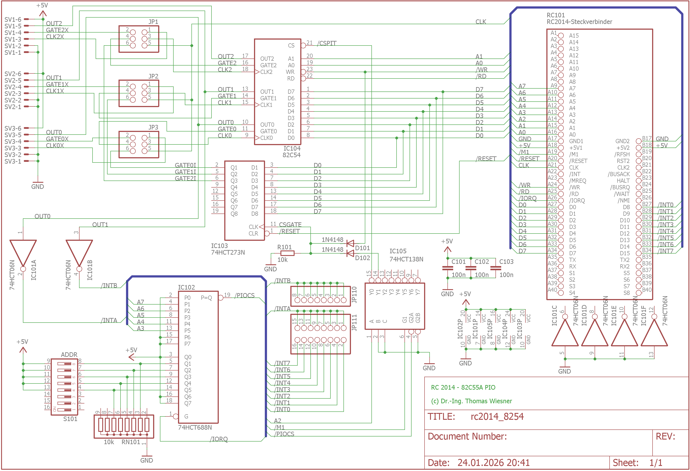

#### <b>D.3 Software:</b>

The BIOS for the card functions is provided in the RCX slot ROM. It contains the additional BASIC commands (`TIMER INIT`, `TIMER 0/1/2 RD/WR`, `TIMER CTRL`, `TIMER SET/RESET GATE`) and an instance of UNAPI based on the approach of KONAMIMAN, so the same functions are callable directly via UNAPI/EXTBIOS from a `.COM` program without the BASIC interpreter. A second test program wires one of the counter outputs to a PIC interrupt channel and keeps a running interrupt count on screen. Please have a look at his page to get a deeper impression on how it works.

Commands implemented in ROM:

+ <i><b>TIMER INIT</i></b>

  Registers the card's IO base address in the RCX table. Must be called once per card before any of the other TIMER commands below will find it.

|  | Definition | BASIC* | UNAPI |
| --- | --- | --- | --- |
| Syntax | TIMER INIT | _TIMER INIT(ADDR) | 33 |
| PARA 1 | IO addr 0...251 | byte or variable | C |

*) ROM only

+ <i><b>TIMER 0 RD</i></b>

  Latches and reads the current 16-bit counter value of Timer 0.

|  | Definition | BASIC* | UNAPI |
| --- | --- | --- | --- |
| Syntax | TIMER 0 RD | _TIMER 0 RD(ADDR,VALUE) | 34 |
| PARA 1 | IO addr 0...251 | byte or variable | C |
| PARA 2 | Word to read | variable | DE as varptr |
| PARA 3 | UNAPI ID Level 2 | -/- | B = 0 |

*) ROM only

+ <i><b>TIMER 0 WR</i></b>

  Loads a new 16-bit count/reload value into Timer 0.

|  | Definition | BASIC* | UNAPI |
| --- | --- | --- | --- |
| Syntax | TIMER 0 WR | _TIMER 0 WR(ADDR,VALUE) | 35 |
| PARA 1 | IO addr 0...251 | byte or variable | C |
| PARA 2 | Word to write | word or variable | DE |
| PARA 3 | UNAPI ID Level 2 | -/- | B = 1 |

*) ROM only

+ <i><b>TIMER 1 RD</i></b>

  Latches and reads the current 16-bit counter value of Timer 1.

|  | Definition | BASIC* | UNAPI |
| --- | --- | --- | --- |
| Syntax | TIMER 1 RD | _TIMER 1 RD(ADDR,VALUE) | 36 |
| PARA 1 | IO addr 0...251 | byte or variable | C |
| PARA 2 | Word to read | variable | DE as varptr |
| PARA 3 | UNAPI ID Level 2 | -/- | B = 2 |

*) ROM only

+ <i><b>TIMER 1 WR</i></b>

  Loads a new 16-bit count/reload value into Timer 1.

|  | Definition | BASIC* | UNAPI |
| --- | --- | --- | --- |
| Syntax | TIMER 1 WR | _TIMER 1 WR(ADDR,VALUE) | 37 |
| PARA 1 | IO addr 0...251 | byte or variable | C |
| PARA 2 | Word to write | word or variable | DE |
| PARA 3 | UNAPI ID Level 2 | -/- | B = 3 |

*) ROM only

+ <i><b>TIMER 2 RD</i></b>

  Latches and reads the current 16-bit counter value of Timer 2.

|  | Definition | BASIC* | UNAPI |
| --- | --- | --- | --- |
| Syntax | TIMER 2 RD | _TIMER 2 RD(ADDR,VALUE) | 38 |
| PARA 1 | IO addr 0...251 | byte or variable | C |
| PARA 2 | Word to read | variable | DE as varptr |
| PARA 3 | UNAPI ID Level 2 | -/- | B = 4 |

*) ROM only

+ <i><b>TIMER 2 WR</i></b>

  Loads a new 16-bit count/reload value into Timer 2.

|  | Definition | BASIC* | UNAPI |
| --- | --- | --- | --- |
| Syntax | TIMER 2 WR | _TIMER 2 WR(ADDR,VALUE) | 39 |
| PARA 1 | IO addr 0...251 | byte or variable | C |
| PARA 2 | Word to write | word or variable | DE |
| PARA 3 | UNAPI ID Level 2 | -/- | B = 5 |

*) ROM only

+ <i><b>TIMER CTRL</i></b>

  Writes the 82C54's mode-control word for one of the three counters - selects counting mode 0..5, BCD vs. binary counting and the read/write byte order, matching the 82C54 datasheet's control word format directly.

|  | Definition | BASIC* | UNAPI |
| --- | --- | --- | --- |
| Syntax | TIMER CTRL | _TIMER CTRL(ADDR,VALUE) | 40 |
| PARA 1 | IO addr 0...251 | byte or variable | C |
| PARA 2 | Word to write | word or variable | E (D must be 0) |
| PARA 3 | UNAPI ID Level 2 | -/- | B = 6 |

*) ROM only

+ <i><b>TIMER SET GATE</i></b>

  Drives one of the card's jumper-selectable GATE inputs high in software instead of wiring it permanently - only takes effect for a counter whose GATE jumper is actually set to the software-controlled position.

	Value 0..7 is allowed

|  | Definition | BASIC* | UNAPI |
| --- | --- | --- | --- |
| Syntax | TIMER SET GATE | _TIMER SET GATE(ADDR,VALUE) | 41 |
| PARA 1 | IO addr 0...251 | byte or variable | C |
| PARA 2 | GATE 0..3 (0..7) | byte or variable | E (D must be 0) |
| PARA 3 | UNAPI ID Level 2 | -/- | B = 7 |

*) ROM only

+ <i><b>TIMER RESET GATE</i></b>

  Drives a jumper-selectable GATE input low again - the counterpart to TIMER SET GATE.

	Value 0..7 is allowed

|  | Definition | BASIC* | UNAPI |
| --- | --- | --- | --- |
| Syntax | TIMER RESET GATE | _TIMER RESET GATE(ADDR,VALUE) | 42 |
| PARA 1 | IO addr 0...251 | byte or variable | C |
| PARA 2 | GATE 0..3 (0..7) | byte or variable | E (D must be 0) |
| PARA 3 | UNAPI ID Level 2 | -/- | B = 8 |

*) ROM only

## E) RC2014 card with SJA1000 CAN controller (single use only)

RC2014 card with SJA1000 CAN controller and RJ45 sockets with automatic termination function. The software provides PELICAN Mode and 250 kBit/s.

Only one card is possible due to RAM allocation and interrupt handling. The interrupt pin of the SJA1000 can be assigned to one of the XIO PIC interrupt channels.

#### <b>E.1 Impressions:</b>

RC2014 card on backplane

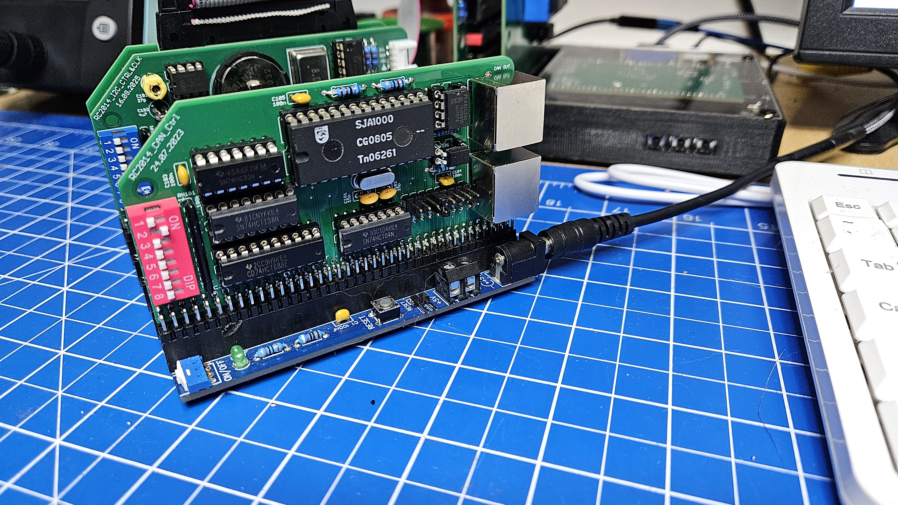

#### <b>E.2 Hardware:</b>

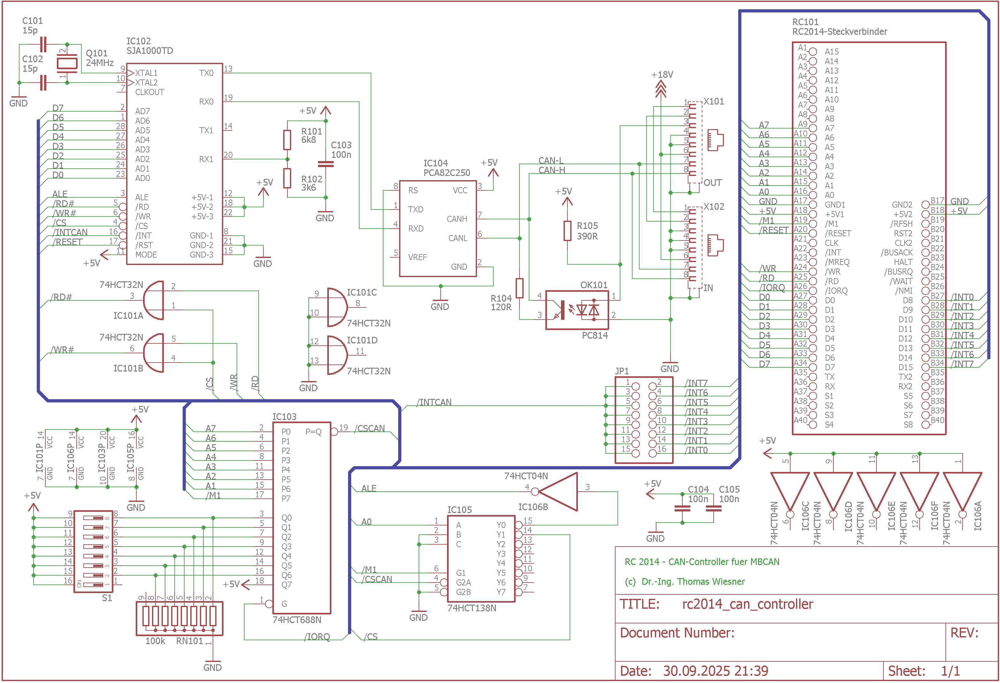

#### <b>E.3 Software:</b>

The BIOS for the card functions is provided in the RCX slot ROM. It contains the additional BASIC commands (`CAN INIT`, `CAN WR/RD`, `CAN CHECK/RX/TX`, `CAN GET ADDR`) and an instance of UNAPI based on the approach of KONAMIMAN, so the same functions are callable directly via UNAPI/EXTBIOS from a `.COM` program without the BASIC interpreter. The test program receives and sends CAN messages interrupt-driven, e.g. for a Maerklin CS3 bus, by registering the ROM's own CAN service routine (returned by `CAN GET ADDR`) directly through `XIO SET ADDR` - no custom interrupt code needed. Please have a look at his page to get a deeper impression on how it works.

Commands implemented in ROM:

+ <i><b>CAN INIT</i></b>

  Initialises RC2014 SJA1000 CAN card at IO address 0..254. The firmware has a ring buffer of 16 messages.

	ACC is the acceptance code and mask

	Array of INT is needed, only low byte is used, len = 8 (see datasheet for further information)

	Index 0 ACR.0, Index 1 ACR.1, Index 2 ACR.2, Index 3 ACR.3

	Index 4 AMR.0, Index 5 AMR.1, Index 6 AMR.2, Index 7 AMR.3

|  | Definition | BASIC* | UNAPI |
| --- | --- | --- | --- |
| Syntax | CAN INIT | _CAN INIT(ADDR,ACC) | 43 |
| PARA 1 | IO addr 0...254 | byte or variable | C |
| PARA 2 | ACC code&mask | array index 0 | DE as varptr |

*) ROM only

+ <i><b>CAN WR</i></b>

  Writes a raw byte directly to any SJA1000 internal register - for manual/advanced configuration beyond what CAN INIT already sets up.

|  | Definition | BASIC* | UNAPI |
| --- | --- | --- | --- |
| Syntax | CAN WR | _CAN WR GATE(ADDR,REG,DATA) | 44 |
| PARA 1 | IO addr 0...254 | byte or variable | C |
| PARA 2 | Register | byte or variable | D |
| PARA 3 | Byte to write | byte or variable | E |

*) ROM only

+ <i><b>CAN RD</i></b>

  Reads a raw byte directly back from any SJA1000 internal register.

|  | Definition | BASIC* | UNAPI |
| --- | --- | --- | --- |
| Syntax | CAN RD | _CAN RD GATE(ADDR,REG,DATA) | 45 |
| PARA 1 | IO addr 0...254 | byte or variable | C |
| PARA 2 | Register | byte or variable | D |
| PARA 3 | Byte to read | variable | A contains result |

*) ROM only

+ <i><b>CAN CHECK</i></b>

  Non-blocking poll of whether a new message has arrived in the firmware's 16-message ring buffer since the last check - call this from a main loop, or from an interrupt handler registered via CAN GET ADDR/XIO SET ADDR, before bothering to call CAN RX.

|  | Definition | BASIC* | UNAPI |
| --- | --- | --- | --- |
| Syntax | CAN CHECK | _CAN CHECK(ADDR,RMC) | 46 |
| PARA 1 | IO addr 0...254 | byte or variable | C |
| PARA 2 | 1 = new msg | variable | A contains result |

*) ROM only

+ <i><b>CAN RX</i></b>

  Pops the oldest queued message out of the 16-message ring buffer, in raw PELICAN 2.0 frame format.

|  | Definition | BASIC* | UNAPI |
| --- | --- | --- | --- |
| Syntax | CAN RX | _CAN RX(ADDR,DATA) | 47 |
| PARA 1 | IO addr 0...254 | byte or variable | C |
| PARA 2 | New msg (PELICAN 2.0) | array len = 13 | DE as varptr |

*) ROM only

+ <i><b>CAN GET ADDR</i></b>

  Returns the address of the ROM's own ready-made CAN interrupt service routine, meant to be handed straight to XIO SET ADDR - receiving and queuing CAN messages this way needs no custom Z80 interrupt code at all, only CAN CHECK/RX in the main program to drain the ring buffer XIO fills in the background.

|  | Definition | BASIC* | UNAPI |
| --- | --- | --- | --- |
| Syntax | CAN RX | _CAN GET ADDR(ADDR,INTDATA) | 48 |
| PARA 1 | IO addr 0...254 | byte or variable | C |
| PARA 2 | RAM address pointer | variable | DE as varptr |

*) ROM only

+ <i><b>CAN TX</i></b>

  Transmits a new message on the CAN bus, in raw PELICAN 2.0 frame format.

|  | Definition | BASIC* | UNAPI |
| --- | --- | --- | --- |
| Syntax | CAN TX | _CAN TX(ADDR,DATA) | 49 |
| PARA 1 | IO addr 0...254 | byte or variable | C |
| PARA 2 | Message (PELICAN 2.0) | array len = 13 | DE as varptr |

*) ROM only

## F) RC2014 card with 4x SPI bus up to 2 MHz via ATMEGA8

RC2014 card with 4 SPI busses selectable via software with baudrate up to 2 MHz. Up to 16 SPI cards are possible. The interrupt pin of the ATMEGA8 can be assigned to one of the XIO PIC interrupt channels.

#### <b>F.1 Impressions:</b>

RC2014 card on backplane

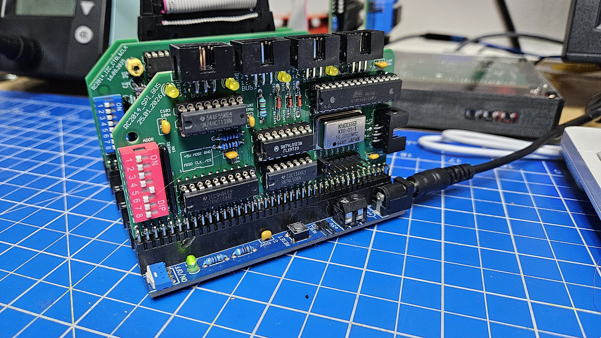

#### <b>F.2 Hardware:</b>

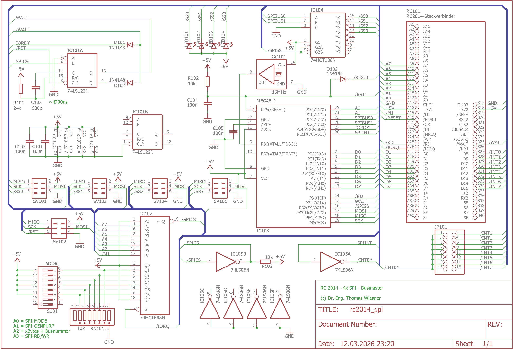

#### <b>F.3 Software:</b>

The BIOS for the card functions is provided in the RCX slot ROM. It contains the additional BASIC commands (`SPI INIT/MODE`, `SPI WR/WRB/RD/RDB/RDH`) and an instance of UNAPI based on the approach of KONAMIMAN, so the same functions are callable directly via UNAPI/EXTBIOS from a `.COM` program without the BASIC interpreter. Up to 4 independent SPI busses are addressable per card; the test program exercises a MCP23S17 GPIO expander as a Port A/B loopback test. Please have a look at his page to get a deeper impression on how it works.

Commands implemented in ROM:

+ <i><b>SPI INIT</i></b>

  Registers the card's IO base address in the RCX table. Must be called once per card before any of the other SPI commands below will find it.

|  | Definition | BASIC* | UNAPI |
| --- | --- | --- | --- |
| Syntax | SPI INIT | _SPI INIT(ADDR) | 50 |
| PARA 1 | IO addr 0...252 | byte or variable | C |

*) ROM only

+ <i><b>SPI WR</i></b>

  Writes a single byte on one of the card's 4 independently selectable SPI busses.

|  | Definition | BASIC* | UNAPI |
| --- | --- | --- | --- |
| Syntax | SPI WR | _SPI WR(ADDR,BUS,DATA) | 51 |
| PARA 1 | IO addr 0...252 | byte or variable | E |
| PARA 2 | SPI BUS 0..3 | byte or variable | C |
| PARA 3 | Byte to write | byte or variable | B |

*) ROM only

+ <i><b>SPI WRB</i></b>

  Writes an arbitrary-length block of bytes on one SPI bus in a single call, instead of looping single SPI WR calls.

|  | Definition | BASIC* | UNAPI |
| --- | --- | --- | --- |
| Syntax | SPI WRB | _SPI WRB(ADDR,BUS,LEN,DATA) | 52 |
| PARA 1 | IO addr 0...252 | byte or variable | H |
| PARA 2 | SPI BUS 0..3 | byte or variable | C |
| PARA 3 | Length of array | byte or variable | B |
| PARA 4 | Data to write | array index 0 | DE as varptr |

*) ROM only

+ <i><b>SPI RD</i></b>

  Reads a single byte back from one SPI bus.

|  | Definition | BASIC* | UNAPI |
| --- | --- | --- | --- |
| Syntax | SPI RD | _SPI RD(ADDR,BUS,DATA) | 53 |
| PARA 1 | IO addr 0...252 | byte or variable | C |
| PARA 2 | SPI BUS 0..3 | byte or variable | B |
| PARA 3 | Byte to read | variable | DE as varptr |

*) ROM only

+ <i><b>SPI RDB</i></b>

  Reads an arbitrary-length block of bytes back from one SPI bus in a single call.

|  | Definition | BASIC* | UNAPI |
| --- | --- | --- | --- |
| Syntax | SPI RDB | _SPI RDB(ADDR,BUS,LEN,DATA) | 54 |
| PARA 1 | IO addr 0...252 | byte or variable | H |
| PARA 2 | SPI BUS 0..3 | byte or variable | C |
| PARA 3 | Length of array | byte or variable | B |
| PARA 4 | Data to read | array index 0 | DE as varptr |

*) ROM only

+ <i><b>SPI RDH</i></b>

  Reads an array of bytes to RC2014 SPI card after sending a header for register selection.

	Both data is handled by one arry. LEN_WR signals length of header beginning with index 0 of the array. LEN_RD starts at index LEN_WR for data to read. Be sure to have a suitable definition for the array.

|  | Definition | BASIC* | UNAPI |
| --- | --- | --- | --- |
| Syntax | SPI RDH | _SPI RDH(ADDR,BUS,LEN_WR,LEN_RD,DATA) | 55 |
| PARA 1 | IO addr 0...252 | byte or variable | C |
| PARA 2 | SPI BUS 0..3 | byte or variable | B |
| PARA 3 | Length of array to write | byte or variable | H |
| PARA 4 | Length of array to read | byte or variable | L |
| PARA 5 | Data to read | array index 0 | DE as varptr |

*) ROM only

+ <i><b>SPI MODE</i></b>

  Sets clock polarity/phase (Mode 0..3) and clock frequency independently for one of the 4 SPI busses, so different chips on different busses can each run at the timing they need. See the ATMEGA8 firmware's datasheet reference for further information.

	MOD (PARA 3):

	0 = SPI_MODE_0, 1 = SPI_MODE_1, 2 = SPI_MODE_2, 3 = SPI_MODE_3

	FQZ (PARA 4):

	0 = 2 MHz, 1 = 1 MHz, 2 = 500 kHz, 3 = 250 kHz

|  | Definition | BASIC* | UNAPI |
| --- | --- | --- | --- |
| Syntax | SPI MODE | _SPI MODE(ADDR,BUS,MOD,FQZ) | 56 |
| PARA 1 | IO addr 0...252 | byte or variable | C |
| PARA 2 | SPI BUS 0..3 | byte or variable | B |
| PARA 3 | Mode | byte or variable | D |
| PARA 4 | Bus frequency | byte or variable | E |

*) ROM only

## G) RC2014 card with ADS1220 4 channel 24 bit A/D converter via ATMEGA8

RC2014 card with ADS1220 module. Up to 16 cards are possible. The interrupt pin of ATMEGA8 can be assigned to one of the XIO PIC interrupt channels.

#### <b>G.1 Impressions:</b>

RC2014 card on backplane

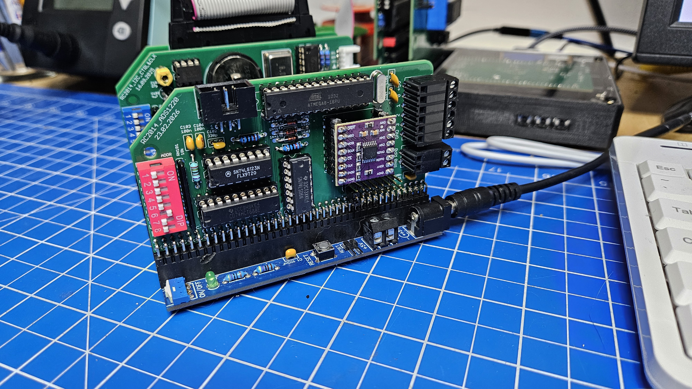

#### <b>G.2 Hardware:</b>

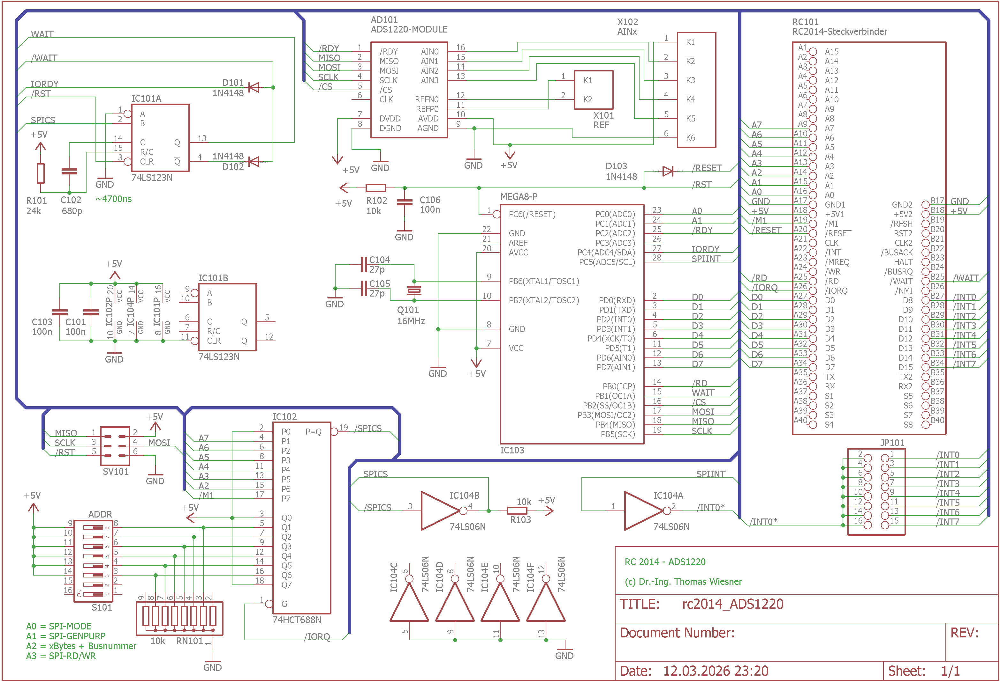

#### <b>G.3 Software:</b>

The BIOS for the card functions is provided in the RCX slot ROM. It contains the additional BASIC commands (`ADS INIT/MODE/CMD/STATUS/READ/GET`) and an instance of UNAPI based on the approach of KONAMIMAN, so the same functions are callable directly via UNAPI/EXTBIOS from a `.COM` program without the BASIC interpreter. `ADS GET` automates the whole measurement sequence (set MODE, start conversion, select channel, read all 4 RESULT bytes) into a single native `SNG` float value. Please have a look at his page to get a deeper impression on how it works.

Commands implemented in ROM:

+ <i><b>ADS INIT</i></b>

  Registers the card's IO base address in the RCX table. Must be called once per card before any of the other ADS commands below will find it.

|  | Definition | BASIC* | UNAPI |
| --- | --- | --- | --- |
| Syntax | ADS INIT | _ADS INIT(BUS) | 57 |
| PARA 1 | IO addr 0...252 | byte or variable | C |

*) ROM only

+ <i><b>ADS MODE</i></b>

  Writes the measurement type to the ADS1220 MODE register

	TYPE (PARA 2):

	0 = SE AIN0-GND, 1 = SE AIN1-GND, 2 = SE AIN2-GND, 3 = SE AIN3-GND, 4 = DE AIN0-AIN1,
	5 = DE AIN0-AIN2, 6 = DE AIN0-AIN3, 7 = DE AIN1-AIN2, 8 = DE AIN1-AIN3, 9 = DE AIN2-AIN3,
	10 = DE AIN1-AIN0, 11 = DE AIN3-AIN2 (SE = single-ended against GND, DE = differential)

|  | Definition | BASIC* | UNAPI |
| --- | --- | --- | --- |
| Syntax | ADS MODE | _ADS MODE(BUS,TYPE) | 58 |
| PARA 1 | IO addr 0...252 | byte or variable | C |
| PARA 2 | Measurement type 0...11 | byte or variable | E |

*) ROM only

+ <i><b>ADS CMD</i></b>

  Sends a raw command byte directly to the ADS1220 - low-level access for start-conversion/reset/power-down and anything else not already covered by the higher-level ADS commands.

|  | Definition | BASIC* | UNAPI |
| --- | --- | --- | --- |
| Syntax | ADS CMD | _ADS CMD(BUS,VAL) | 59 |
| PARA 1 | IO addr 0...252 | byte or variable | C |
| PARA 2 | Raw value 0...255 | byte or variable | E |

*) ROM only

+ <i><b>ADS STATUS</i></b>

  Reads the ADS1220's own status byte back, decoded by the firmware into the currently selected read-channel (`rChannel`) and result-byte counter (`mCount`) - lets a program confirm what the last ADS CMD actually set, rather than assuming it took effect.

|  | Definition | BASIC* | UNAPI |
| --- | --- | --- | --- |
| Syntax | ADS STATUS | _ADS STATUS(BUS,VAL) | 60 |
| PARA 1 | IO addr 0...252 | byte or variable | C |
| PARA 2 | Byte to read | variable | DE as varptr |

*) ROM only

+ <i><b>ADS READ</i></b>

  Reads one of the four raw RESULT bytes (sign/exponent byte plus two mantissa bytes) of the current conversion. The firmware's own byte counter (`mCount`) auto-increments on every call and wraps from 4 back to 0, so four consecutive ADS READ calls step through a whole result in order.

|  | Definition | BASIC* | UNAPI |
| --- | --- | --- | --- |
| Syntax | ADS READ | _ADS READ(BUS,VAL) | 61 |
| PARA 1 | IO addr 0...252 | byte or variable | C |
| PARA 2 | Byte to read | variable | DE as varptr |

*) ROM only

+ <i><b>ADS GET</i></b>

  Automates a full measurement: sets MODE, starts conversion, selects channel, reads all 4 RESULT bytes into a native SNG variable

	TYPE (PARA 2):

	0 = SE AIN0-GND, 1 = SE AIN1-GND, 2 = SE AIN2-GND, 3 = SE AIN3-GND, 4 = DE AIN0-AIN1,
	5 = DE AIN0-AIN2, 6 = DE AIN0-AIN3, 7 = DE AIN1-AIN2, 8 = DE AIN1-AIN3, 9 = DE AIN2-AIN3,
	10 = DE AIN1-AIN0, 11 = DE AIN3-AIN2 (SE = single-ended against GND, DE = differential)

|  | Definition | BASIC* | UNAPI |
| --- | --- | --- | --- |
| Syntax | ADS GET | _ADS GET(BUS,TYPE,VAL) | 62 |
| PARA 1 | IO addr 0...252 | byte or variable | C |
| PARA 2 | Measurement type 0...11 | byte or variable | B |
| PARA 3 | Result | SNG variable | DE as varptr |

*) ROM only

## H) RC2014 card SC725 with Z80 SIO and Z80 CTC

The ROM of RCX contains BASIC and UNAPI commands to steer SC725 from original RC2014 manufactor.

#### <b>H.1 Impressions:</b>

RC2014 card on backplane

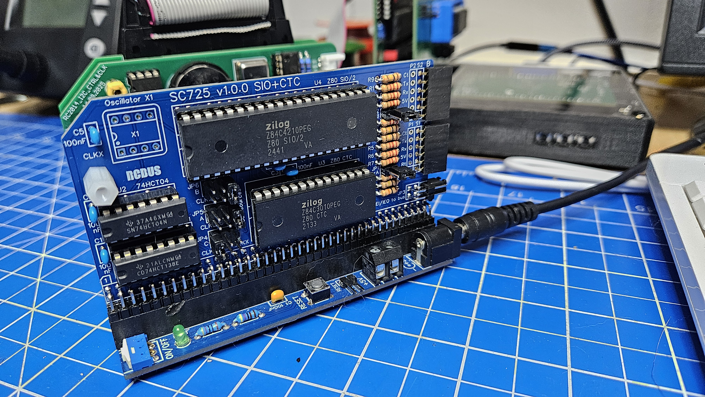

Details coming soon

## I) RC2014 card with MCP4822 4 channel 12 bit D/A converter via ATMEGA8

RC2014 card with 2x MCP4822. Up to 16 cards are possible. The interrupt pin of ATMEGA8 can be assigned to one of the XIO PIC interrupt channels.

#### <b>I.1 Hardware:</b>

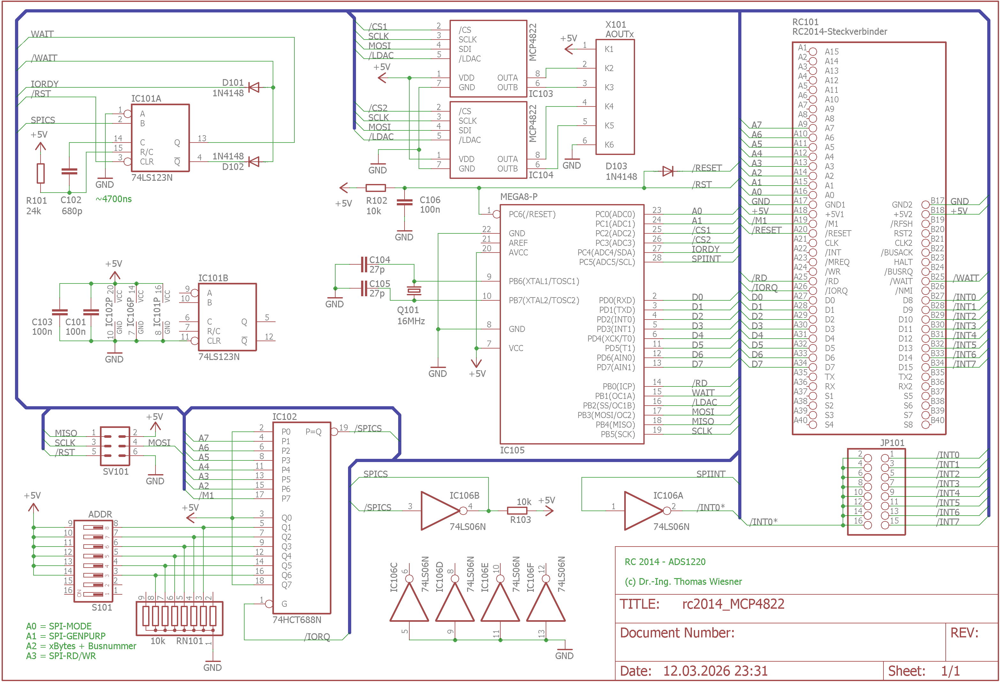

Details coming soon

