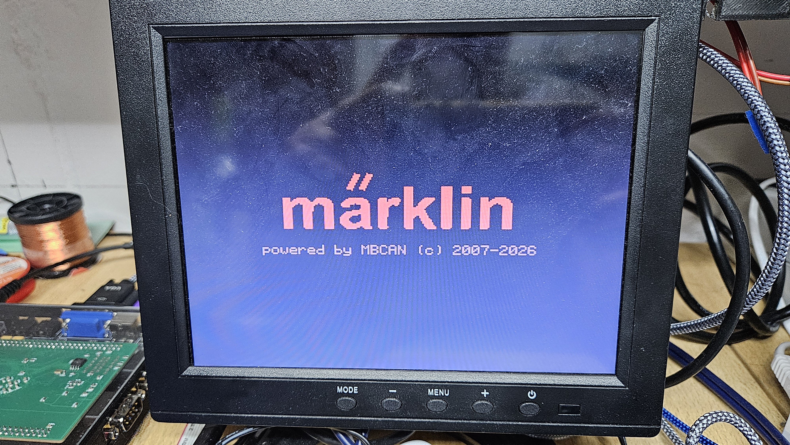
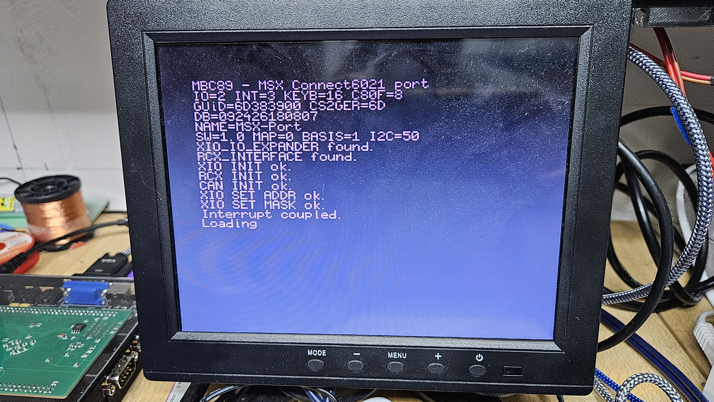
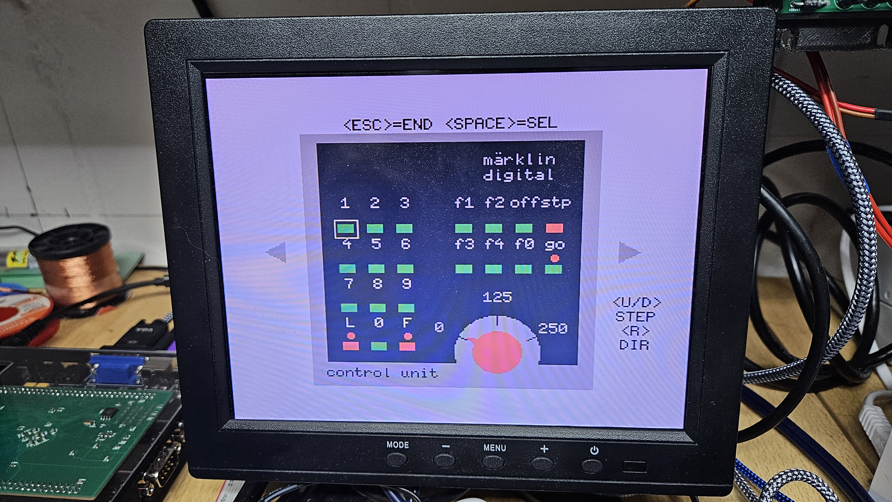
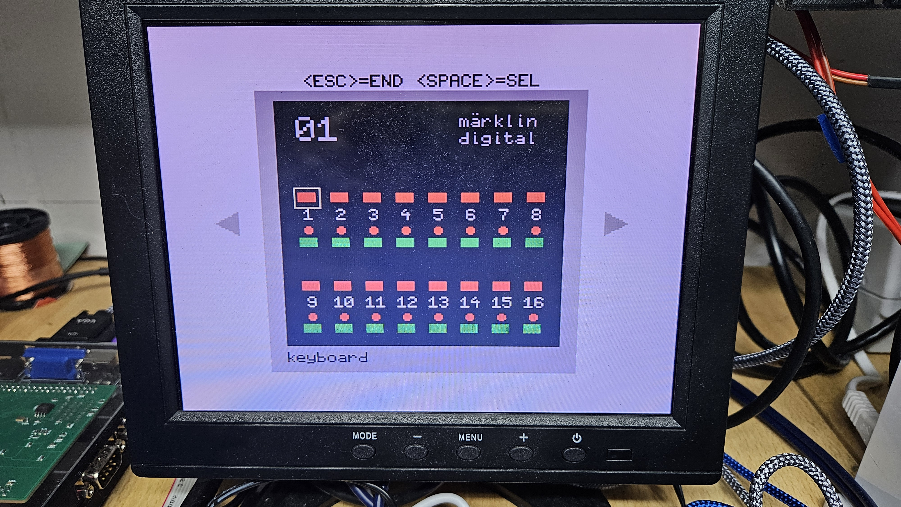
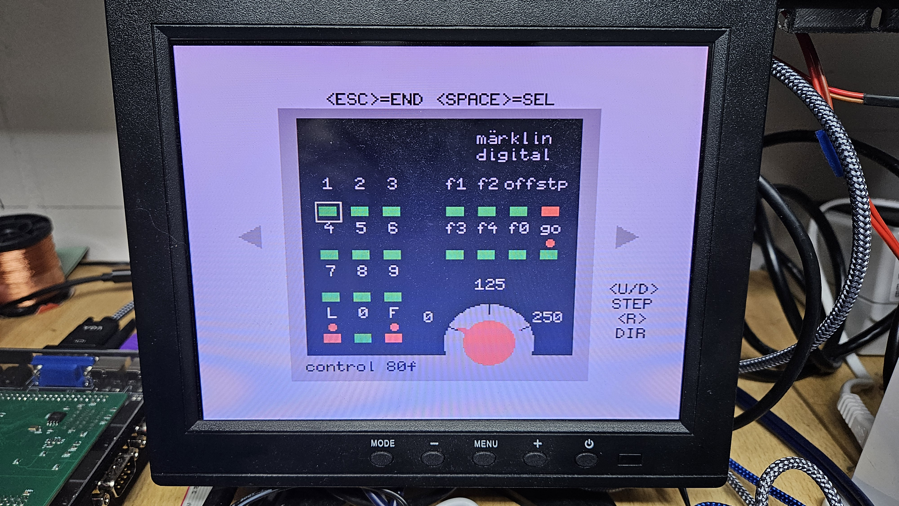

# mbc89 - Maerklin Connect6021 CAN accessory module for MSX1

A full MSX1/MSX-DOS 1 port of `mbc89`, one of the MBCAN family of Maerklin CS2/CS3 CAN-bus accessory
modules, built on top of the [XIO cartridge](../xio/) (switched IO/IM2/PIC)
and the [RCX ROM cartridge](../rcx/)'s `RC2014 card E` (SJA1000 CAN controller). Instead of the
original's ATmega firmware, this version runs as a normal `.COM` program on an MSX1 with an RC2014
backplane, using [MSXgl](https://github.com/aoineko-fr/MSXgl)/SDCC for the C port.

The module registers itself on the CS2/CS3 CAN bus exactly like a real Connect6021, answers the
config-channel walk (SW version, central-station-type mapping, keyboard base address, I2C clock),
and simulates up to 16 Keyboard-6040 keyboards, one CU6021 control unit, and up to 8 Control80f
control units - all as one switchable on-screen panel, driven by the MSX keyboard and the real CAN
bus at the same time (a button press sends a real CAN message; an incoming CAN message updates the
panel's LEDs/knob live).

## Impressions

Splash screen



Boot info screen - startup configuration (environment variables), persisted configuration, and
discovery/init results for the XIO/RCX/CAN chain



CU6021 panel



Keyboard-6040 panel



Control80f panel



A full startup-to-panel video is included: [`images/startup.mp4`](images/startup.mp4).

## Panels

All three panel types share one carousel (two triangle sprites, `SPACE` switches between instances)
and the same bidirectional CAN wiring:

- **Keyboard-6040** (up to 16 instances, one CS2 address block of 16 per instance): a grid of
  switch/signal pairs, cursor-navigated with the MSX keyboard, sends `CAN_ID_ZUBEHOER_SCHALTEN`
  (0x16) on press and updates its LEDs live from incoming messages for the same address range.
- **CU6021** (1 instance): loco speed/direction/F0-F4 control, `CAN_ID_LOK_*` (0x08/0x0A/0x0C).
- **Control80f** (up to 8 instances): same loco control as CU6021, addressed per instance.

Startup configuration (`IO`/`INT`/`INT_MODE`/`KEYB`/`C80F`) is read from MSX-DOS 2 environment
variables via a raw BDOS `GENV` wrapper (MSX-DOS 1 has no `DOS_GetEnv()` of its own). Config values
changed via ParaCenter or a real CS2/CS3 central station (SW version, central-station-type mapping,
keyboard base address, I2C clock, module name, GUiD/PC database number) are persisted to
`MBC89.CFG` on the boot disk via the FCB-based MSX-DOS 1 file functions, and reloaded on every
startup - see `mbc89_store.c`.

## Source layout

- `mbc89.c` - main program: environment variables, splash/boot-info screens, XIO/RCX/CAN discovery
  and init, hands off to the GUI.
- `mbc89_base.c`/`.h` - CS2/CS3 registration, PC/CSx config-channel protocol, `PC_ARRAY_DATA`
  systemarray bridge.
- `mbc89_com.c`/`.h` - simulated Connect6021 firmware (SW/mapping/basis/I2C config channels, CONNECT6021
  handshake, loco database, Stopp/Go, loco speed/direction/function handling).
- `mbc89_can.c`/`.h` - conversion between the logical 13-byte Maerklin CAN message and the raw PeliCAN
  SJA1000 TX/RX register format `rcx_io.h` expects.
- `mbc89_gui.c`/`.h` - SCREEN2 panel rendering and interaction (Keyboard-6040/CU6021/Control80f
  carousel).
- `mbc89_sim.c`/`.h` - simulated plug/voltage/temperature sensor values (`P`/arrow keys).
- `mbc89_store.c`/`.h` - `MBC89.CFG` file-based persistence (FCB, MSX-DOS 1 compatible).
- `content/` - embedded panel graphics/sprite data (RLE-packed screen data, generated content
  headers).

## Rebuilding

Clone [MSXgl](https://github.com/aoineko-fr/MSXgl), then copy [`../lib/xio_io/`](../lib/xio_io/)'s
contents into `MSXgl/lib/xio_io/`, [`../lib/rcx_io/`](../lib/rcx_io/)'s contents into
`MSXgl/lib/rcx_io/`, [`../lib/dostools/`](../lib/dostools/)'s contents into `MSXgl/lib/dostools/`,
and this folder's contents into `MSXgl/projects/Mbc89/` - all paths must stay space-free, a
requirement of the MSXgl build tool itself. `project_config.js` already references the libraries it
needs with the matching relative paths:

```js
CompileOpt = "-I../../lib/xio_io -I../../lib/rcx_io -I../../lib/dostools";
AddLibs = [ "../../lib/xio_io/xio_io.lib", "../../lib/rcx_io/rcx_io.lib", "../../lib/dostools/dostools.lib" ];
```

```sh
cd MSXgl/projects/Mbc89 && node ../../engine/script/js/build.js
```

A prebuilt [`Mbc89.com`](Mbc89.com) is included so the module can be used without rebuilding.

## Hardware

Runs on an MSX1 with `RC2014 card E` (SJA1000 CAN controller, see [`../rcx/rc2014_card_e/`](../rcx/rc2014_card_e/))
installed behind an [XIO cartridge](../xio/)+RC2014 adapter, connected to a Maerklin CS2/CS3 CAN bus.
